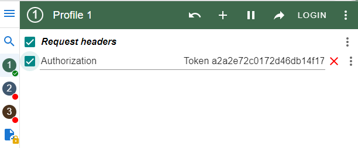

# Cinema API

API service for cinema management written on DRF

## Installing using GitHub

Python3 must be already installed

Install PostgresSQL and create db

```shell
git clone https://github.com/DHushchyk/cinema-api.git
cd Cinema_API
python3 -m venv venv
source venv\Scripts\activate (on Windows)
source venv\bin\activate (on Mac)
pip install -r requirements.txt
set DB_HOST=<your db hostname>
set DB_NAME=<your db name>
set DB_USER=<your db username>
set DB_PASSWORD=<your db user password>
python manage.py migrate
python manage.py runserver
```

## Run with docker

Docker should be installed

```shell
docker-compose build
docker-compose up
```

## Getting access
* create user via  api/user/register/
* get access token via api/user/token/
* use [ModHeader](https://chrome.google.com/webstore/detail/modheader/idgpnmonknjnojddfkpgkljpfnnfcklj) to get access to all features

(an example how to use ModHeader)




## Features
* JWT authenticated
* Admin panel /admin/
* Documentation is located at api/doc/swagger/
* Managing orders and tickets
* Creating movies with genres, actors
* Adding movie sessions
* Filtering movies and movie sessions

